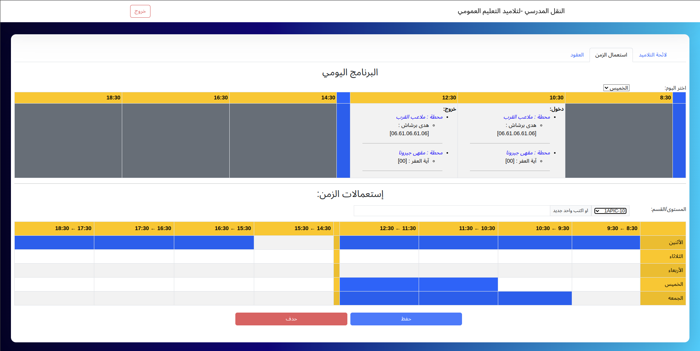

# Bus-Route-Planner - مخطط مسار الحافلة

**Bus Route Planner** is a serverless React application designed to streamline student transportation management. It generates optimized bus routes, organizes station stops with precise timings, and manages subscriptions for students and their guardians. The app demonstrates the integration of scheduling algorithms with external JSON data storage to solve logistical challenges effectively.

---

## Context

This project was built upon a real request from a bus company owner (January 2023) who faced challenges in writing schedules and creating roadmaps for bus drivers due to complicated schedules from different students/schools. The app was developed as a practical solution to address these issues, saving time and reducing errors in manual scheduling. By automating the process, the app not only solved a logistical problem but also improved operational efficiency for the bus company.

To demonstrate its capabilities without exposing sensitive information, fake data has been generated for demo purposes.

---

## Features

- **Dynamic Schedule Aggregation**: Processes class schedules to generate an efficient roadmap for bus drivers.
- **Optimized Driver Itinerary**: Automatically organizes station stops and timings to minimize travel time.
- **Subscription Management**: Tracks student subscriptions, payments, and facilitates coordination between parents and the bus owner.
- **External JSON Storage**: Uses a lightweight, serverless architecture powered by external JSON blob storage for data management.

---

## Screenshots

- **Student Schedule Overview**
  

---

## Demo

---

## Contact

For production implementation assistance, please reach out:  
**linkedin**: https://www.linkedin.com/in/aallali/
 

---

## License

This project is shared for demonstration purposes under the **MIT Licence**. Please contact me for production rights or commercial use.

